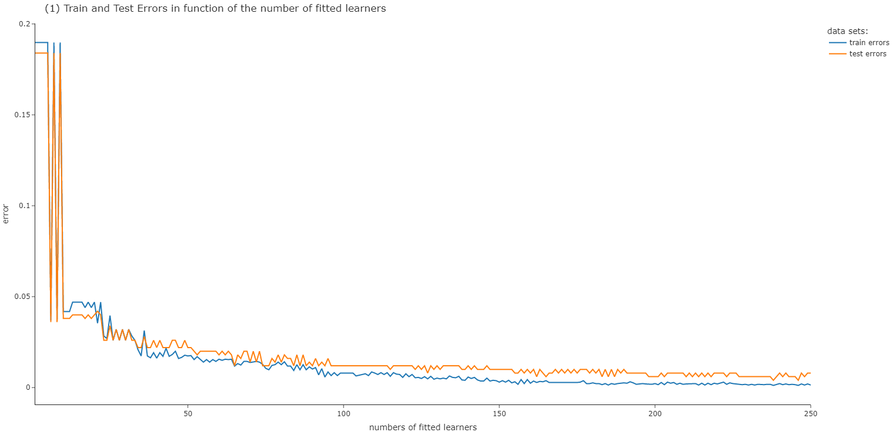
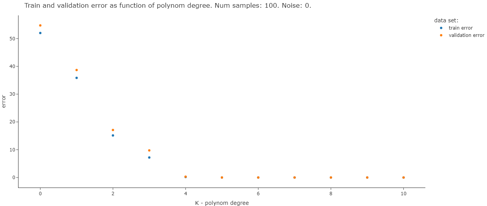
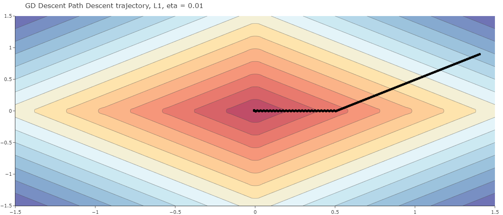

# Introduction to Machine Learning
**Hebrew University, Jerusalem, Israel**

The following repository contains:
1) IMLearn -  software package for ML algorithems developed throughout the course IML in the Hebrew University of Jerusalem.
2) course exercises - application of the algorithms on real data.

# Summary

### ex1 - Estimation Theory

### ex2 - Linear Regression

### ex3 - Classification

#### Preceptrom Classifier

##### separable data:

##### inseparable data:

#### Bayes Classifier

### ex4 - PAC  Ensemble Methods**

#### data without noise

#### data with noise

### ex5 - PCA, Kernels, Regularization and Cross-Validation

### ex6 - Convex Optimization & Gradient Descent

#### Descent trajectory with L1 and L2

#### Compare exponentially decaying rates

#### Regularized Logistic Regression

